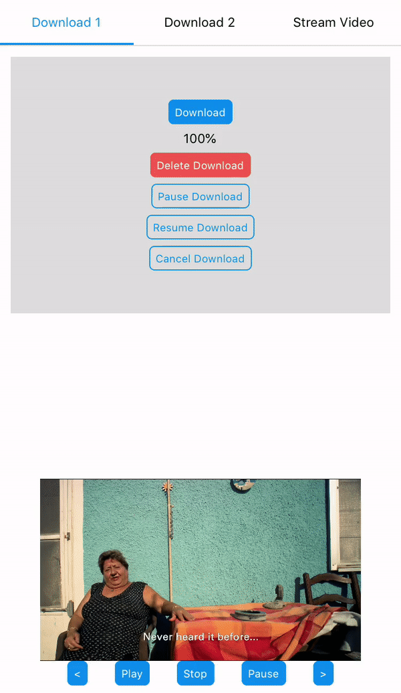

React Native Media Suite
========================

Forked from [react-native-media-kit](https://www.npmjs.com/package/react-native-media-kit)

This is a video and audio component for react-native apps, supporting both iOS and Android, with API similar to HTML video.

Supported media types:

* iOS: Should be the same as those supported by [AVPlayer](https://developer.apple.com/library/ios/documentation/AVFoundation/Reference/AVPlayer_Class/)
* Android: Should be the same as those supported by [ExoPlayer](https://github.com/google/ExoPlayer)



## Installation

1. Run: `$ npm install --save react-native-media-suite@latest`
2. For each platform (iOS/Android) you plan to use, follow one of the options for the corresponding platform.

#### iOS

1. Right click on **Libraries** and choose 'Add files to "Project Name"'.
2. Navigate to `project_name/node_modules/react-native-media-suite/ios/` and add the file `react-native-media-suite.xcodeproj`.
3. Open project settings and at the top choose '**Build Phases**'
4. Expand the '**Link Binary With Libraries**' section.
5. Click the + at the bottom of the list
6. Add the `libreact-native-media-suite.a` file

#### Android

##### `android/settings.gradle`

```
include ':react-native-media-suite'
project(':react-native-media-suite').projectDir = new File('../node_modules/react-native-media-suite/android')
```

##### `android/app/build.gradle`

```
dependencies {
    ...
    compile project(':react-native-media-suite')
}
```

##### `android/app/src/main/java/.../MainApplication.java` (or `MainActivity.java` on RN <= 0.29)

```
import za.co.digitalwaterfall.reactnativemediasuite.MediaSuitePackage;
...
protected List<ReactPackage> getPackages() {
    return Arrays.<ReactPackage>asList(
        new MainReactPackage(),
        new MediaKitPackage()
    );
}
```

## Documentation

#### Video Player API

The API is designed to mimic the html [`<video />`](https://developer.mozilla.org/en-US/docs/Web/HTML/Element/video).

```
import Video from 'react-native-media-suite';
...
render() {
    return (
        <Video
            ref={ref => this.videoRef = ref}
            style={{ width: width, height: width * 9 / 16) }}
            src="https://bitmovin-a.akamaihd.net/content/playhouse-vr/mpds/105560.mpd"
            autoplay={false}
            preload="none"
            loop={false}
            controls={true}
            muted={false}
            poster="http://static.yoaicdn.com/shoppc/images/cover_img_e1e9e6b.jpg"
        />
    );
}
```

##### Properties

| Property Name          | Description                              | iOS  | Android |
| ---------------------- | ---------------------------------------- | ---- | ------- |
| `src`                  | The URL of the video                                                                                                               | :white_check_mark:   | :white_check_mark:      |
| `offline`              | The ID of the downloaded asset                                                                                                     | :white_check_mark:   | :x:      |
| `autoplay`             | True to automatically begins to play. Default is `false`.                                                                          | :white_check_mark:   | :x:      |
| `preload`              | Can be `'none'`, `'auto'`. Default is `'none'`.                                                                                    | :white_check_mark:   | :x:      |
| `loop`                 | `true` to automatically seek back to the start upon reaching the end of the video. Default is `false`.                             | :white_check_mark:   | :white_check_mark:      |
| `controls`             | `true` to show controls to allow user to control video playback, including seeking, and pause/resume playback. Default is `true`.  | :white_check_mark:   | :x:      |
| `poster`               | An image URL indicating a poster frame to show until the user plays.                                                               | :white_check_mark:   | :x:      |
| `muted`                | `true` to silence the audio. Default is `false`.                                                                                   | :white_check_mark:   | :x:      |
| `onPlayerPaused`       |                                                                                                                                    | :white_check_mark:   | :x:      |
| `onPlayerPlaying`      |                                                                                                                                    | :white_check_mark:   | :x:      |
| `onPlayerFinished`     |                                                                                                                                    | :white_check_mark:   | :x:      |
| `onPlayerBuffering`    |                                                                                                                                    | :white_check_mark:   | :x:      |
| `onPlayerBufferOK`     |                                                                                                                                    | :white_check_mark:   | :x:      |
| `onPlayerProgress`     |                                                                                                                                    | :white_check_mark:   | :x:      |
| `onPlayerError`        |                                                                                                                                    | :white_check_mark:   | :x:      |
| `onPlayerBufferChange` |                                                                                                                                    | :white_check_mark:   | :x:      |

##### Reference Methods

- `pause()`
- `play()`
- `stop()`
- `seekTo()`


For details about the usage of above APIs, check [`library/media-player/media-player-view.js`](library/media-player/media-player-view.js).

### Downloader API

##### Initialisation

Methods can be passed to the constructor to be called when events occur. The following callbacks are supported.

```
import { Downloader } from 'react-native-media-suite';
...
const downloader = new Downloader({
    onDownloadFinished: eventData => console.log(`eventData: ${eventData}`),
    onDownloadProgress: eventData => console.log(`eventData: ${eventData}`),
    onDownloadStarted: eventData => console.log(`eventData: ${eventData}`),
    onDownloadError: eventData => console.log(`eventData: ${eventData}`),
    onDownloadCancelled: eventData => console.log(`eventData: ${eventData}`)
});
```

| Method Name          | Evocation Property                                                                                  | iOS | Android  |
|----------------------|-----------------------------------------------------------------------------------------------------|-----|----------|
| `onDownloadFinished` | `{ `**`downloadID`**`: string, `**`downloadLocation`**`: string, `**`size`**`: integer (bytes) }`   | :white_check_mark:  | :white_check_mark:      |
| `onDownloadProgress` | `{ `**`downloadID`**`: string, `**`percentComplete`**`: float }`                                    | :white_check_mark:  | :white_check_mark:      |
| `onDownloadStarted`  | `{ `**`downloadID`**`: string }`                                                                    | :white_check_mark:  | :white_check_mark:      |
| `onDownloadError`    | `{ `**`downloadID`**`: string, `**`error`**`: string, `**`errorType`**`: string }`                  | :white_check_mark:  | :white_check_mark:      |
| `onDownloadCanceled` | `{ `**`downloadID`**`: string }`                                                                    | :white_check_mark:  | :white_check_mark:      |

##### Methods

```
downloader.restoreMediaDownloader();
downloader.downloadStream('someMediaUrl', 'someDownloadId', );
downloader.deleteDownloadedStream('someDownloadId');
downloader.pauseDownload('someDownloadId');
downloader.resumeDownload('someDownloadId');
downloader.cancelDownload('someDownloadId');
```

| Method Name              | Properties               | iOS | Android |
|--------------------------|--------------------------|-----|---------|
| `restoreMediaDownloader` |                                                                                                 | :white_check_mark:  | :white_check_mark:      |
| `downloadStream`         | url: `string`, downloadID: `string`, bitRate: `integer` (Optional - defaults to max bit-rate)   | :white_check_mark:  | :white_check_mark:      |
| `deleteDownloadedStream` | downloadID: `string`                                                                            | :white_check_mark:  | :white_check_mark:      |
| `pauseDownload`          | downloadID: `string`                                                                            | :white_check_mark:  | :white_check_mark:      |
| `resumeDownload`         | downloadID: `string`                                                                            | :white_check_mark:  | :white_check_mark:      |
| `cancelDownload`         | downloadID: `string`                                                                            | :white_check_mark:  | :white_check_mark:      |

For details about the usage of above APIs, check [`library/media-downloader/download-manager.js`](library/media-downloader/media-downloader.js).

## TODO

- [ ] Downloading
- [ ] DRM
- [ ] Google Play
- [ ] Air Play